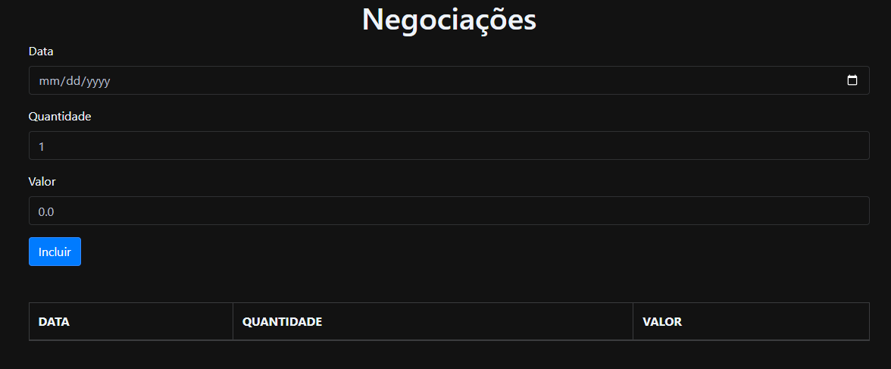
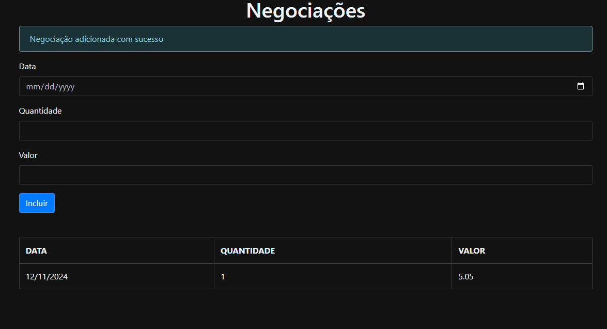

  

<h3 align="center">alurabank</h3>

  

---
 
 

 Curso de Typescript da alura - aplicação de negociações em  bolsa de valores.
      

 
 

## 🧐 Sobre 

**
Projeto do curso da alura sobre typescript
**

  

    aplicação de negociações em bolsa de valores. É uma aplicação web que permite que cadastremos uma data, uma quantidade, um valor de uma negociação e que possamos exibir no futuro em uma lista e que o usuário possa verificar o que foi cadastrado.
  

## 

  

  ao adcionar uma negociação em um dia válido, ele irá criar um template embaixo com as informações da negociação e irá ter um aviso de que foi adcionado!  
  
  

##

  

  Caso tente adcionar uma negociação em um dia inválido (dias não uteis), não será criado o template e um erro aparecerá no topo dando um aviso
  

##
## 🌐💻 Saiba mais sobre Typescript 

- [Typescript](https://www.typescriptlang.org) - Linguagem de programação utilizada

