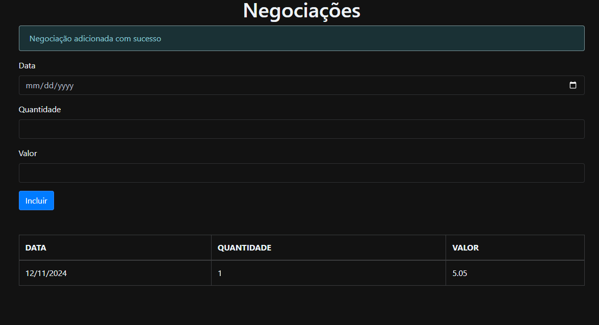

  

<h3 align="center">alurabank</h3>

  

---
 
 

 Typescript course from alura - stock exchange negotiations application.
      

 
 

## 🧐 About 

**
Alura course project about typescript
**

  

    Stock exchange negotiations application. It is a web application that allows us to register a date, a quantity, and a value of a negotiation and that we can display in the future in a list and that the user can check what has been registered.
  

## 

  

  when adding a negotiation on a valid day, it will create a template below with the information of the negotiation and there will be a notice that it has been added!  
  
  

##

  

  If you try to add a negotiation on an invalid day (non-working days), the template will not be created and an error will appear at the top giving a warning.
  

##
## 🌐💻 Learn more about Typescript 

- [Typescript](https://www.typescriptlang.org) - Programming language used

 
 